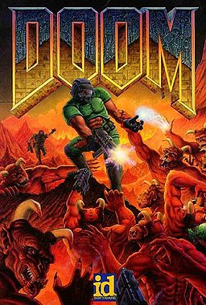

# DOOM on the Waveshare ESP32-S3-RLCD-4.2



1993 Doom running on an ESP32-S3 driving a 4.2" **fully reflective** LCD — no backlight,
300×400 native portrait, over SPI.

Renders at ~22 fps at the panel's full 400×300, 1 bit per pixel with ordered dithering.

<br clear="right">

> Cover art © id Software. The Doom *engine* is GPLv2; the artwork and game data are not,
> and no WAD is distributed here.

Built on [`ozkl/doomgeneric`](https://github.com/ozkl/doomgeneric) via
[`bane9/ESP_DOOM`](https://github.com/bane9/ESP_DOOM), rebuilt for **ESP-IDF v5** and
retargeted from an ILI9341 TFT to this board.

---

## Status

| Subsystem | State |
|---|---|
| Build (`idf.py build`, esp32s3) | working |
| Boot, 8 MB octal PSRAM | working — verified on hardware |
| Zone heap in PSRAM | working — 3 MB, placement asserted at runtime |
| WAD via `esp_partition_mmap` | working — full 5 MB window, zero-copy lumps |
| Game loop | working — demo runs, ~22 fps driving the panel |
| Input over USB-Serial-JTAG | working |
| Sound — game-side logic | working — channels, distance attenuation live |
| Sound — audio output (ES8311) | **stub**, silent |
| Display (ST7305, 1 bpp, 8×8 Bayer) | working — full 400×300, flush-limited |

### The panel

The display driver was deliberately held back until the controller could be identified from a
real source rather than guessed at — an init sequence written from memory would have been for
the wrong chip. It is an **ST7305**, confirmed by Waveshare's own demo
source ([`waveshareteam/ESP32-S3-RLCD-4.2`](https://github.com/waveshareteam/ESP32-S3-RLCD-4.2)),
a Zephyr in-tree board port, and the u8g2 upstream driver
([olikraus/u8g2#2661](https://github.com/olikraus/u8g2/issues/2661)).

| Panel fact | Value | Source |
|---|---|---|
| Controller | ST7305 | Waveshare demo, Zephyr, u8g2 |
| Panel | 300×400 portrait, driven 400×300 landscape | Waveshare `user_config.h` |
| Colour depth | **1 bpp, black and white** | Waveshare product spec |
| SPI clock | 24 MHz | Waveshare ESP-IDF demo |
| Refresh rate | **32 Hz** high-power mode, 1 Hz low-power | init reg `0xB2 = 0x12` |
| Windowed update | supported — `0x2A`/`0x2B` address window, `0x2C` write | u8g2 driver |

The significant consequence is **1 bpp**. Doom's 256-colour output has to be reduced to pure
black and white, so the palette LUT becomes a luminance table plus a dither, not a colour
conversion. Everything else — geometry, the 40/50 px window offsets, keeping the framebuffer
8-bit indexed — was designed for this and carries over unchanged.

At 32 Hz against Doom's 35 Hz tic rate, the panel refresh is the ceiling. We are not there
yet — see [Performance](#performance).

---

## Performance

Measured on hardware, per frame, at 400×300:

| | dither | flush | fps |
|---|---|---|---|
| before optimisation | 25.5 ms | 24.7 ms | 14.6 |
| now | **6.8 ms** | 25.7 ms | **22.4** |

**The flush is now the bottleneck.** It is not data — 15000 bytes at 24 MHz is ~5 ms. It is
*transaction overhead*: per-row addressing means 200 rows × 6 SPI transactions = 1200
transactions per frame, each with fixed setup cost. Batching the row commands or queueing
them so the driver pipelines rather than blocks should recover much of it.

Per-row addressing is **required**, not a preference. The controller does not auto-increment
from the end of one row into the start of the next; a single flat transfer smears the image
into vertical striping. This was tested twice, and the second time was wrongly declared
working on the basis of a frame-rate improvement — which measures nothing about whether
pixels land in the right place. Do not re-enable `ST7305_FlushMode = 0` without looking at
the panel.

---

## Console keys

The game reads stdin, so these work over any serial terminal (`screen /dev/cu.usbmodem101
115200`). They are intercepted before Doom sees them.

| Key | Effect |
|---|---|
| `t` | grey-ramp calibration screen — 16 bands through the real tone pipeline |
| `b` / `B` | raise / lower the black point |
| `w` / `W` | raise / lower the white point |
| `]` / `[` | curve darker / lighter |
| `\` | toggle Bayer ↔ plain threshold |
| `g` | de-ghost cycle (drives every pixel to both extremes) |
| `o` | cycle orientation flips |
| `f` | toggle flush mode — **flat is broken, see above** |

Game controls: `W`/`S` forward/back, `A`/`D` strafe, `,`/`.` turn, space use, `F` fire,
arrows, Enter/Esc/Tab, `1`–`7` weapons. Ctrl is not transmittable over a serial console,
hence `F` for fire.

---

## Hardware

**Waveshare ESP32-S3-RLCD-4.2** — ESP32-S3-WROOM-1-N16R8, 16 MB flash, 8 MB octal PSRAM.

Pin assignments are taken from the official Waveshare schematic and treated as
authoritative — see [`CLAUDE.md`](CLAUDE.md).

| Bus | Pins |
|---|---|
| Display (SPI) | CS 40, RESET 41, SCL 11, SDA 12, RS/DC 5, TE 6 |
| Audio (I2S) | MCLK 16, SCLK 9, LRCK 45, DSDIN 8, ASDOUT 10, PA_CTRL 46 |
| I²C (shared) | SDA 13, SCL 14 |
| TF card (SPI) | MOSI 21, SCK 38, MISO 39, CS 17 |
| Buttons | BOOT 0, KEY 18 |

Codec ES8311, mic ADC ES7210, amp NS4150B into a **mono** speaker connector.

Two constraints worth knowing before planning peripherals: the Type-C port wires straight to
GPIO19/20 as **native USB with no bridge chip**, and the board has **no 5 V boost**, so USB
host mode needs 5 V injected on header pin 2. The radio is **BLE only** — no Bluetooth
Classic, which rules out most game controllers.

---

## Setup from scratch

Assumes a Mac with the board and a USB-C cable, and nothing else installed.

### 1. Install ESP-IDF v5.x

**Version matters.** This will not build on v3 or v4 — those use a different
component API (`register_component()` rather than `idf_component_register()`).

```bash
mkdir -p ~/esp && cd ~/esp
git clone -b v5.5.2 --recursive https://github.com/espressif/esp-idf.git
cd esp-idf && ./install.sh esp32s3
```

Activate it in each new shell:

```bash
. ~/esp/esp-idf/export.sh
```

If you have more than one ESP-IDF installed, a stale `IDF_PATH` in your shell will
make `export.sh` pick the wrong Python environment and fail with missing packages.
`unset IDF_PATH` first if that happens.

### 2. Build

```bash
git clone https://github.com/URL42/doom-esp32s3-rlcd.git
cd doom-esp32s3-rlcd
idf.py set-target esp32s3
idf.py build
```

`sdkconfig` is generated and gitignored — `sdkconfig.defaults` is the source of
truth. To change config: edit `sdkconfig.defaults`, **delete `sdkconfig`**, then
`idf.py reconfigure`. Values already in `sdkconfig` otherwise win, so edits to
the defaults file appear to do nothing.

### 3. Flash the firmware

```bash
idf.py -p /dev/cu.usbmodem101 flash
```

Find your port with `ls /dev/cu.usbmodem*`. If it reports the port is busy, close
Arduino IDE's **Serial Monitor** — it reclaims the port whenever the board
re-enumerates. `lsof /dev/cu.usbmodem101` shows what is holding it.

### 4. Flash a WAD

The WAD is **not** in this repo and lives in its own flash partition:

```bash
esptool.py -p /dev/cu.usbmodem101 write_flash 0x310000 doom1.wad
```

Shareware `DOOM1.WAD` is 4,196,020 bytes. ESP_DOOM's bundled `doom1-cut.wad`
works but has **all `DS*` and `D_*` lumps stripped**, so it is silent by
construction — use a real one if you want audio.

### 5. Watch the console

```bash
screen /dev/cu.usbmodem101 115200
```

Quit with **Ctrl-A**, then **K**, then **y**. This is also how you reach the
tuning keys (see [Console keys](#console-keys)). `idf.py monitor` works too but
is fussier about the IDF environment.

### 6. Pair a controller (optional)

The board is **BLE only** — no Bluetooth Classic — so Switch/X-input gamepad
modes cannot work at the silicon level. Put an 8BitDo Micro in **Keyboard mode**
(the `K` switch position) and hold its pair button until the LED flashes. The
board scans continuously and connects on its own; the console logs
`controller connected`.

Program the buttons in 8BitDo's Ultimate Software to send these:

| Button | Key | Action |
|---|---|---|
| D-pad ↑ / ↓ | `W` / `S` | forward / back |
| D-pad ← / → | `,` / `.` | turn |
| Y / A | `A` / `D` | strafe left / right |
| B | `F` | fire |
| X | `Space` | use |
| Start / Select | `Enter` / `Esc` | menu |

---

---

## Partition layout

16 MB flash:

| Name | Type | Offset | Size |
|---|---|---|---|
| `nvs` | data/nvs | `0x9000` | 24 K |
| `phy_init` | data/phy | `0xf000` | 4 K |
| `factory` | app | `0x10000` | 3 M |
| `wad` | `0x42`/`0x06` | `0x310000` | 5 M |
| `storage` | data/fat | `0x810000` | 7 M |

The WAD partition is **5 MB, not 4**: shareware `DOOM1.WAD` is 4,196,020 bytes and a 4 MiB
partition holds 4,194,304 — it overflows by 1,716 bytes. It is also 64 KB-aligned so the
mapping starts on an MMU page boundary. Ultimate Doom (~12 MB) and Doom II (~14 MB) do not
fit alongside a 3 MB app and would need the SD card.

---

## Design notes

### The WAD is memory-mapped, and `W_CacheLumpNum` needed no patching

Doom's WAD layer already has a zero-copy path, inherited from Chocolate Doom:

```c
if (lump->wad_file->mapped != NULL)
    result = lump->wad_file->mapped + lump->position;
```

Hand it a `mapped` pointer and every lump read becomes a pointer into memory-mapped flash.
All the work is in [`w_file.c`](components/doom/platform/w_file.c) producing that pointer.

**There is deliberately no sliding mmap window.** `W_CacheLumpNum` hands out pointers the
renderer holds across frames; moving the window would invalidate live pointers and surface as
roaming graphical corruption rather than a clean failure. The `ESP_ERR_NO_MEM` fallback is
therefore a different strategy — leave `mapped` NULL and read lumps into zone memory, where
they stay put. On this board the full 5 MB map succeeds and the fallback is not needed.

### The framebuffer stays 8-bit indexed

Upstream doomgeneric expands to 32-bit XRGB and ESP_DOOM to RGB565; both pay a per-pixel
lookup every frame. This port keeps Doom's native indexed output all the way to the panel and
applies `DG_Palette` at blit time. Half the memory (64000 bytes), one less pass over the
frame, and a full-screen palette effect — damage flash, invulnerability — costs 256
conversions instead of 64000.

The frame is **not** scaled to fill the panel. `DOOMGENERIC_RESX/RESY` match Doom's 320×200
exactly and the driver centres it by offsetting its write window (40 px horizontal, 50 px
vertical within the 400×300 landscape frame). A `_Static_assert` enforces this.

### Tone is a levels stretch, not just a gamma

The panel has one bit per pixel, so `DG_Palette` holds perceptual luminance (Rec.601 weights)
rather than colour. A flat RGB average would wash out Doom's greens and leave foliage and the
HUD too dark.

Luminance then goes through a **levels stretch before any curve**: map
`[black_point .. white_point]` onto the full 0–255 range, then apply a mild power curve.

A single gamma cannot do this job, which is why tuning it alone oscillated past correct in
both directions (2.4 → 3.2 → 1.9 → 1.0 → 0.8). Doom's palette is bottom-heavy — most of the
game sits in the dark third of the range — so one global curve either crushes that to solid
black or lifts everything including what should stay black. On a reflective panel the curve
also wants to sit slightly *below* 1, because dithered dots visually gain like ink on paper.

Press `t` for a 16-band grey ramp rendered through the identical path, and tune against that
rather than against moving game frames.

The 8-bit → 1-bit reduction sits behind a function pointer — `DG_SetDither(DG_DITHER_BAYER)`
or `DG_DITHER_THRESHOLD` — so the options can be compared on the real panel rather than
argued about.

The default is a 4×4 ordered Bayer matrix, chosen for **temporal stability**: a given
brightness always resolves the same way at a given screen position, so panning the view does
not make flat surfaces crawl. Floyd–Steinberg produces better stills but reshuffles its whole
pattern when the image shifts by a pixel, which reads as shimmering on a moving 3D image.

A red damage flash still registers, incidentally — the flash palette raises luminance across
the board, so the screen visibly brightens even with the hue gone.

### Input synthesises key releases on a timer

Terminals send a byte stream, not key up/down events. The releases cannot be queued alongside
their presses: `d_loop.c` runs `ProcessEvents()` to completion before `BuildTiccmd()`, so a
press and release in the same pass set and clear `gamekeydown[k]` with nothing observing it in
between. Movement, fire and use would silently never work **while menus still did**, because
menus are edge-triggered on `ev_keydown`.

So presses are held for 120 ms and released on a later call. Terminal auto-repeat extends the
hold rather than re-pressing, which turns a held key into continuous motion.

### USB-Serial-JTAG stdin needs the driver installed

`usb_serial_jtag_get_read_bytes_available()` returns 0 unconditionally unless the driver is
installed — it only inspects the driver's RX ring buffer. The VFS non-blocking read path
consults only that function, and the no-driver FIFO reader is reachable solely from the
blocking branch. With `O_NONBLOCK` and no driver, `read()` returns `EWOULDBLOCK` forever no
matter what the host sent, while log output works perfectly. `DG_Init` installs the driver and
calls `usb_serial_jtag_vfs_use_driver()`.

### About that ~70 fps

It is a scheduling artifact, **not** a render ceiling. `TryRunTics` returns early at a tic
boundary specifically to let the screen update, giving roughly two display passes per 35 Hz
tic, and the loop sleeps between them. The CPU has substantial headroom; the panel is expected
to be the constraint.

---

## Controls (serial console)

| Key | Action |
|---|---|
| `W` / `S` | forward / back |
| `A` / `D` | strafe left / right |
| `,` / `.` | turn left / right |
| arrows | move / turn |
| space | use |
| `F` | fire |
| `Enter`, `Esc`, `Tab` | menu, map |
| `1`–`7` | weapons |

Ctrl is not usable as fire over a serial console, hence `F`.

---

## Known issues

- **Motion smear.** Moving edges drag for a few frames. Partly the panel's liquid-crystal
  response time, which no code can fix, and partly our ~22 fps — each frame is held ~45 ms.
  Raising the frame rate should reduce the perceived smear.
- **Title and menu screens do not fill the panel.** `TITLEPIC`, the menus and the status bar
  are fixed 320×200 assets in the WAD. The 3D view is resolution-independent and does fill
  400×300, but the 2D artwork needs patch scaling at draw time to match, which is not yet
  implemented.
- **`snd_cachesize` defaults to 64 MB** in `i_sound.c` — meaningless on this board and worth
  reducing before the audio backend lands.
- **`w_file_stdc.c`** is still compiled by the source glob and pulls `fopen`/`fread` in for a
  path that can never run.
- **`I_GetPaletteIndex`** reads byte-swapped palette entries and compares 8-bit against 5-bit
  channels. Only reachable under `-testcontrols`.
- IWAD discovery in `d_main.c` is commented out in favour of a hardcoded `doom1.wad`, so the
  `-iwad` argument is dead (`-mb` beside it is live).

---

## Out of scope so far

Panel driver, ES8311 audio output, USB host / controller input, savegames.

---

## Licence

Doom source is **GPLv2** — see [`LICENSE`](LICENSE). Doom is © id Software.
